# 🤖 QTClaw WhatsApp Bot：全能社群自动化管理引擎

> **QTClaw 是为高频社群运营打造的重型自动化武器。** 
> 针对 WhatsApp 营销场景中的炸群、刷屏、管理效率低等痛点，提供一套攻防兼备的全自动解决方案。

---

## 🔥 核心功能深度解析

### 1. 🛡️ 极速防御系统 
**彻底终结恶意炸群，守护群组信任度。**
*   **高频防刷屏：** 独家算法监控发送频率。可精确配置：`在 X 秒内发送超过 Y 条消息`，系统将立即执行 **[自动踢出成员] + [自动清空该成员历史消息]**。
*   **全自动防链接：** 实时检测群内消息。非管理员发送任何形式的 URL 链接，系统秒速拦截并处理，确保群内流量不外流。
*   **7x24h 毫秒级巡逻：** 机器人全天候在线，响应速度达到毫秒级，比人工手动清理效率提升 100 倍以上。

### 2. 🔄 独家：无感自动切号系统
**业务永不断线，告别监控空窗期。**
*   **主备调度逻辑：** 系统支持“1个工作号 + N个备用号”滚动模式。
*   **智能灾备：** 当当前工作账号遭遇风控或封禁时，监控中心将在 **2-5 秒内** 自动激活备用账号无缝接管群管理。
*   **风险对冲：** 这种高可靠调度机制极大降低了因单个账号封禁导致整个群组失控的风险。

### 3. 🚀 自动化任务中心
**一人管理百号矩阵，运营效率指数级提升。**
*   **批量群组操作：** 支持自动化批量加群、一键批量退群。
*   **批量资料配置：** 批量修改头像、昵称、个人资料，快速完成账号矩阵的包装与伪装。
*   **权限一键管理：** 批量操作群组管理员的上任与下放，轻松掌控海量社群的权限结构。

### 4. 📈 营销转化工具
*   **智能欢迎语：** 新人进群瞬间发送预设图文欢迎辞，第一时间精准植入广告信息。
*   **关键词自动回复：** 模拟真人客服，针对用户咨询的关键词自动推送联系方式、业务详情或引流链接。
*   **协议强拉 (Beta)：** 针对协议号深度优化，支持定向拉取目标用户进入群组，实现快速起量。

---

## 🏗️ 系统运行逻辑

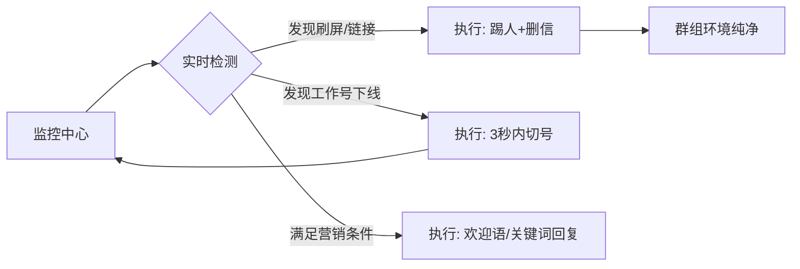
---
## 💡 为什么选择 QTClaw？

*   **非官方协议深度定制：** 绕过繁琐界面，直接基于底层协议交互，响应更快，操作权限更高。

*   **攻防一体化：** 既是社群的“强效清道夫”，也是业务增长的“自动化加速器”。

*   **极致稳定性：** 针对协议号易损耗的特性，通过成熟的逻辑层（切号系统）完美实现业务零中断。
---

## 📞 获取与测试

如果您需要 查看功能演示视频、咨询代理合作 或 定制化部署，请通过以下渠道联系：

技术支持 (✈️)： @alongkeji88888

---
## 📞 演示效果

### WhatsAPP测试效果
<video controls src="video_2026-05-11_11-43-29-1.mp4" title="Title"></video>

### 面板功能
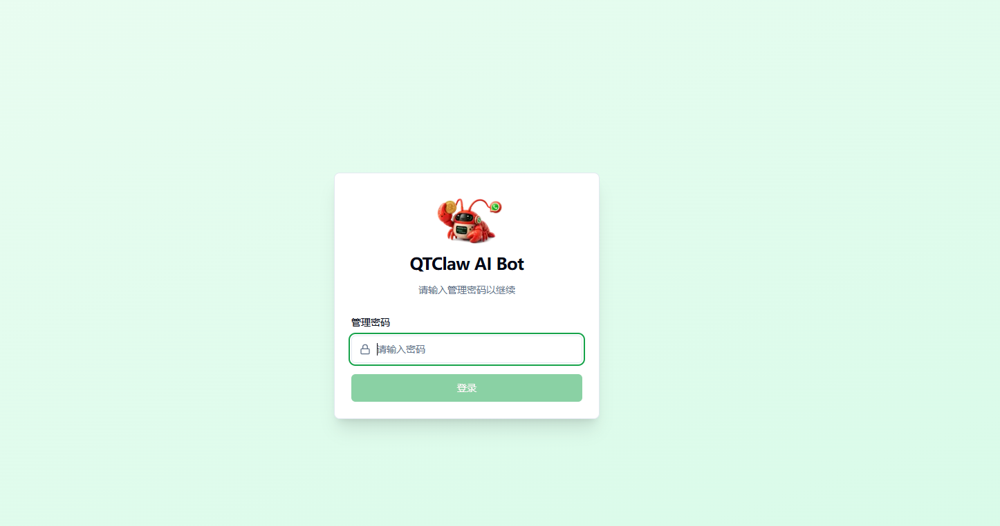
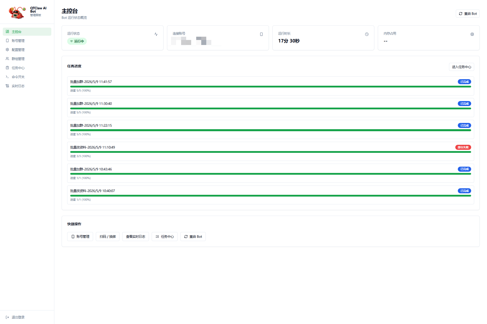
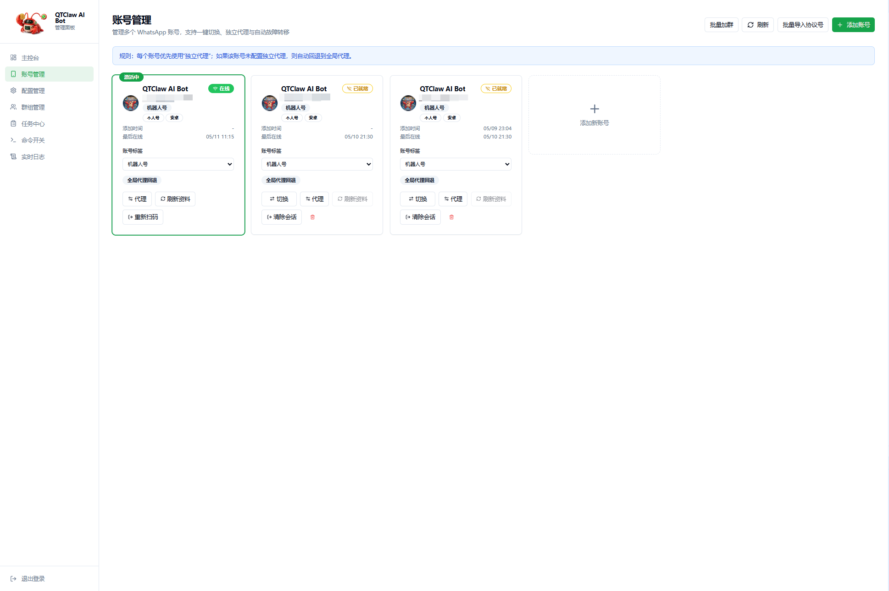
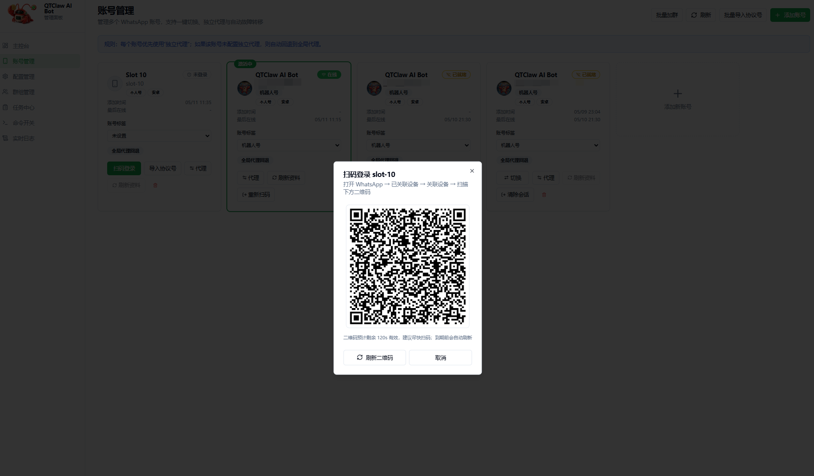
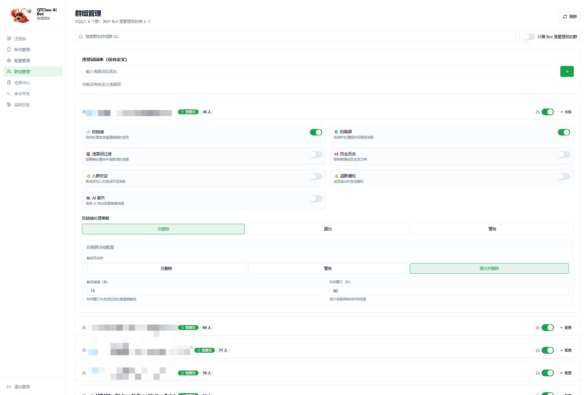
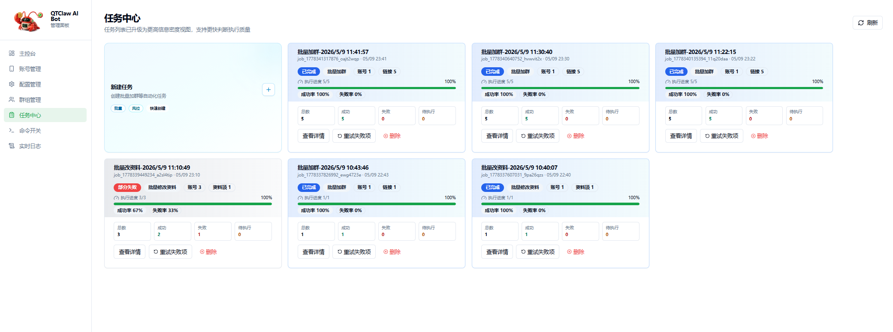
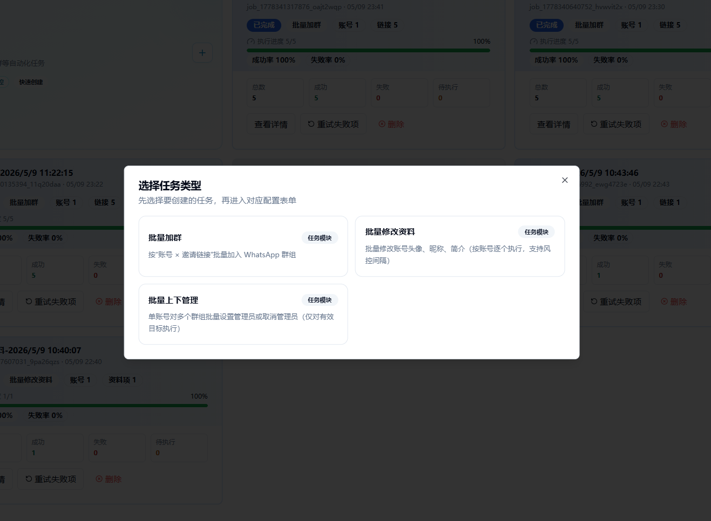
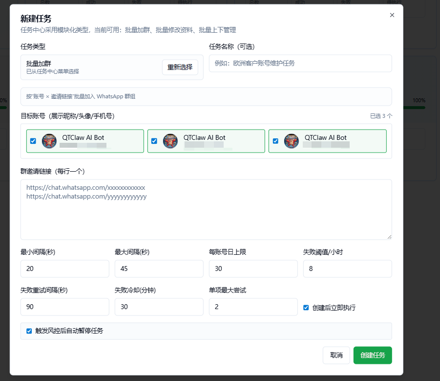
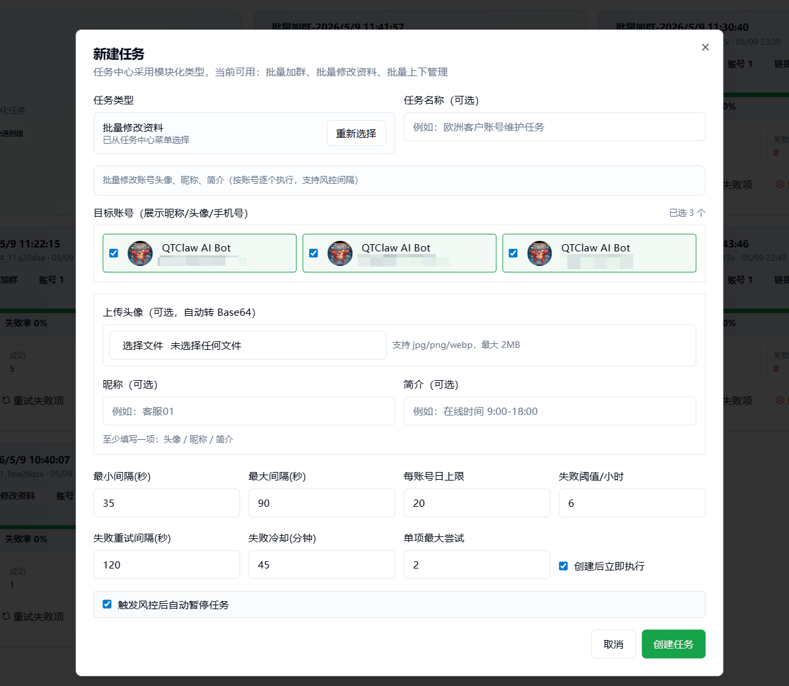
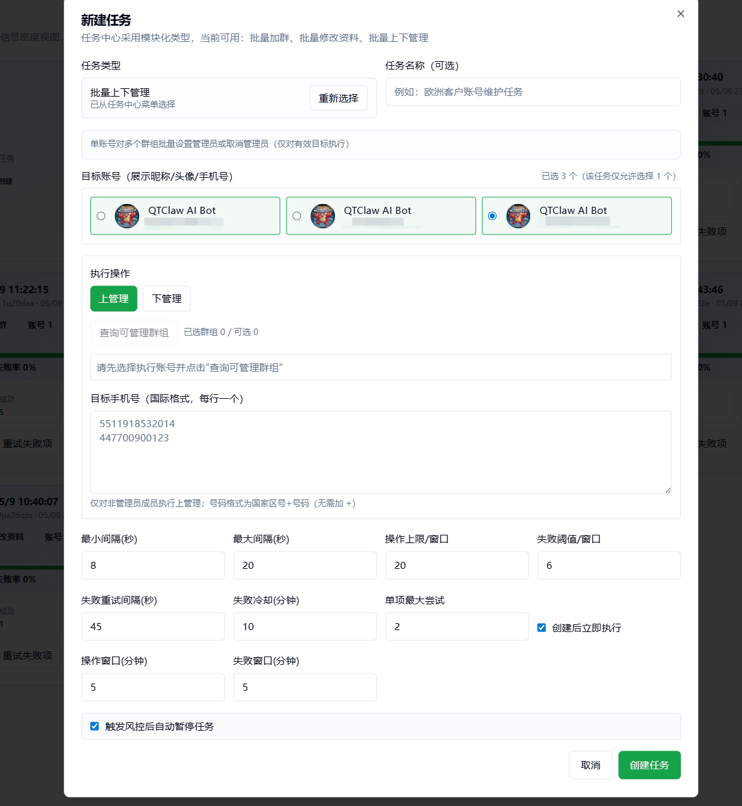
© 2026 QTClaw Technical Team. 为全球代理提供高效、稳定的 WhatsApp 自动化技术。